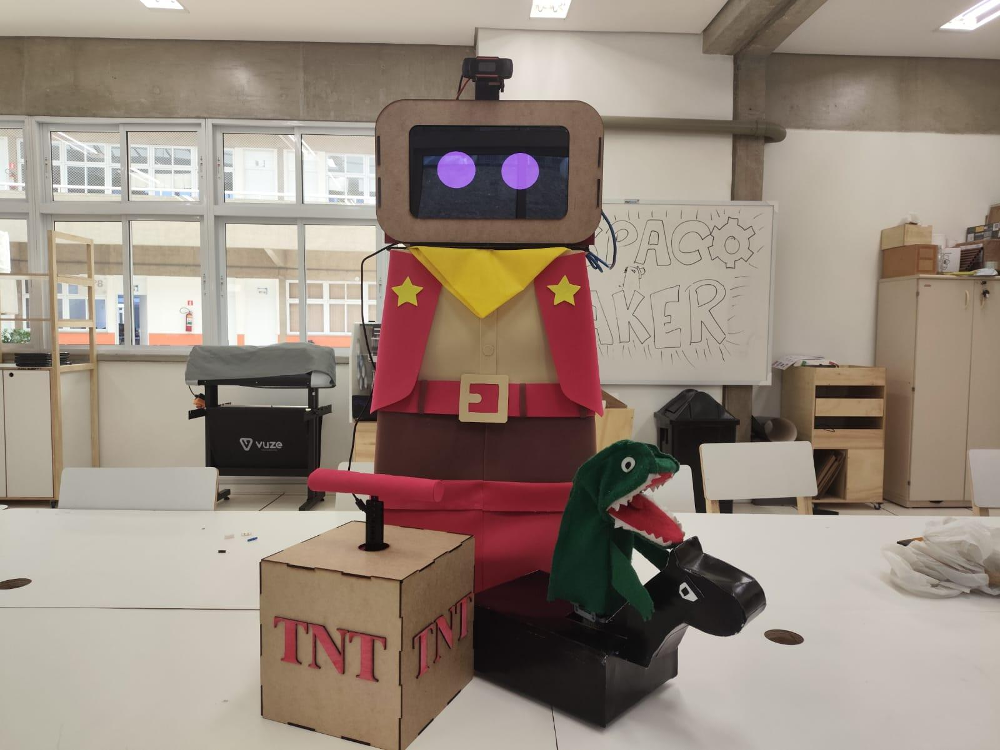

<h1 align="center">🤖 AI-Byte-Gorythm System | RoboCup 2025</h1>

  
  
  
  

> **Repositório oficial do sistema integrado de Visão Computacional, Inteligência Artificial e Controle Embarcado** do robô **AI-Byte-Gorythm** (Campeão Nacional da OBR 2024 e Destaque no Mundial da RoboCup 2025).

---

  

---

## 🧠 Arquitetura do Sistema

O robô opera com uma **arquitetura distribuída** de alto desempenho, separando a inteligência da atuação física:

* 👁️ **O Cérebro (Python + OpenCV):** Executado no computador principal. Processa matrizes de imagem da câmera em tempo real para detectar rostos, reconhecer gestos (contagem de dedos via `cvzone`/`MediaPipe`), gerenciar a engine gráfica dos olhos na tela e calcular a lógica de movimentação.
* 🦾 **Os Músculos (C++ + Arduino Mega):** Atua estritamente como *hardware driver*. Recebe pacotes de comandos assíncronos via Serial (ex: `move_Fwd 150`, `servo 90`), decodifica as *strings* usando um parser customizado super leve, e converte as ordens em sinais PWM para os controladores de motor (Ponte H) em um sistema de tração 4WD.

---

## ⚙️ Funcionalidades Principais

* 🎯 **Rastreamento Facial Automático (Face Tracking):** O robô identifica rostos no palco e calcula o erro de posicionamento (X e Y) em pixels, convertendo o desvio em correções automáticas de giro e aproximação.
* ✋ **Reconhecimento de Gestos (Hand Tracking):** Mapeamento de *landmarks* das mãos em tempo real. O robô conta os dedos do usuário e mede distâncias para disparar comandos lógicos da apresentação teatral.
* 🎭 **Expressões Faciais Dinâmicas e Áudio:** Motor gráfico integrado (`pygame`) que reage ao ambiente. Os olhos piscam, mudam de cor, demonstram emoções e sincronizam com arquivos de vídeo/áudio predefinidos.
* ⚡ **Custom Serial Parser (C++):** Para evitar atrasos no loop principal do hardware, foi construído um interpretador de comandos próprio do zero no Arduino, que fatia e executa os pacotes recebidos do Python sem depender de bibliotecas pesadas.

 
---

## 🚀 Como Executar o Projeto

### 1. Requisitos de Hardware
* 1 Computador (PC/Notebook/Mini-PC)
* 1 Webcam conectada ao PC
* 1 Arduino Mega conectado via USB ao PC
* 4 Motores DC com Drivers Ponte H e 1 Servomotor

### 2. Preparando os Músculos (C++)
1. Abra o arquivo `AlCode21_05_2025.ino` na Arduino IDE.
2. Selecione a placa **Arduino Mega** e a porta correspondente.
3. Faça o upload. O Arduino ficará em modo de escuta.

### 3. Preparando o Cérebro (Python)
Certifique-se de ter o Python 3.10+ instalado. Instale as dependências executando o comando abaixo no seu terminal:

    pip install opencv-python cvzone mediapipe pygame pyserial moviepy numpy

### 4. Ajustes de Configuração (`config.py`)
Antes de executar, revise as variáveis globais no arquivo `config.py`:
* `PORT = "COM20"` ➔ Atualize para a porta USB onde seu Arduino está conectado.
* `DEBUG_MODE = True` ➔ Ative caso queira rodar o código apenas em software, sem enviar dados para a porta Serial (evita erros de compilação se o robô físico não estiver conectado).
* `PARA TROCAR A CAMERA` ➔ Acesse o arquivo `/functions/camera` e troque a variavel `CAMERA` para o index desejado (padrão 0).

### 5. Start!
Com o ambiente pronto, inicie o sistema executando na raiz do projeto:

    python main.py

---

## 🖧 Protocolo de Comunicação (Serial)

A ponte entre o Python e o C++ ocorre via *strings* separadas por espaço. Principais comandos suportados pelo Arduino:

| Comando | Parâmetros | Descrição |
| :--- | :--- | :--- |
| `adjustMotors` | `[m1] [m2] [m3] [m4]` | Calibra a potência base individual dos 4 motores. |
| `move_Fwd` | `[velocidade] [tempo]` | Move o robô para frente aplicando o PWM calibrado. |
| `servo` | `[angulo]` | Ajusta a inclinação da câmera/cabeça. |
| `stop` | `N/A` | *Kill switch*. Corta a energia de todos os motores imediatamente. |

---

  <i>Desenvolvido por Nycolas Queiroz Gimenez para a Equipe de robótica SESI Hortobots.</i>

